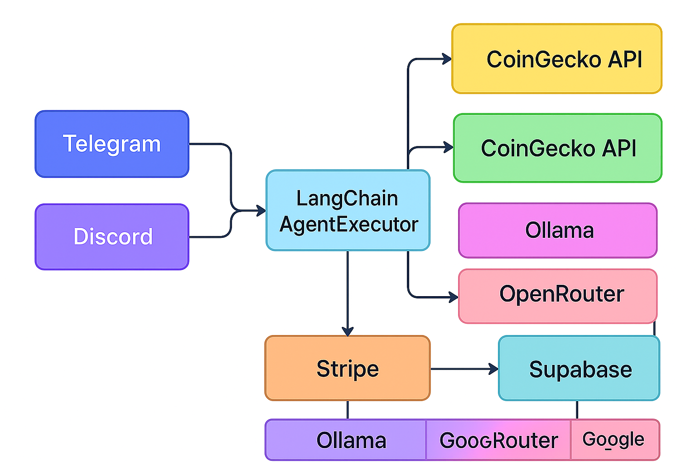
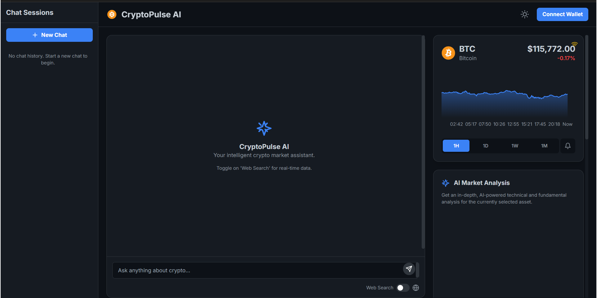

# CryptoPulse AI 🤖📈

<p align="center">
  <em>An AI-powered, full-stack finance agent for the cryptocurrency market.</em>
</p>

<p align="center">
  
  
  
  
</p>

## 🌟 Vision

To create a full-stack finance agent platform that uses LLM-based agents to:

*   Analyze markets and execute trades.
*   Detect fraud and anomalies in real-time.
*   Generate compliance audits and reports.

## ✨ Key Features

*   **🤖 AI-Powered Insights**: At its core, CryptoPulse AI uses a powerful LLM-based agent to analyze market data, sentiment, and technical indicators, providing insights that go beyond traditional charting tools.
*   **🔐 Secure & Autonomous**: The platform is designed with a security-first mindset, featuring a robust architecture for secure key management and autonomous trading with user-defined guardrails.
*   **🌐 Open & Extensible**: Built on a modern, open-source stack, CryptoPulse AI is designed to be extensible, allowing for the integration of new exchanges, data sources, and trading strategies.
*   **📈 Real-time Market Analysis**: Live price tracking, interactive charts, and a dynamic news feed.
*   **💬 AI Chat Assistant**: An intelligent, conversational agent powered by Google Gemini for market queries and trade execution.
*   **🛡️ Planned Backend Power**: The future of CryptoPulse AI includes autonomous trading agents, real-time fraud detection, and automated portfolio management.
*   **✍️ Secure & Auditable**: All actions are logged, and API keys are managed with a security-first approach.

## 🛠️ Technology Stack

*   **Frontend:** React, TypeScript, Vite, Tailwind CSS, Zod
*   **Backend:** Python, FastAPI, LangChain, Pydantic
*   **Database:** Supabase (PostgreSQL + pgvector)
*   **AI/ML:** Google Gemini, Ollama, OpenRouter
*   **Infrastructure:** Docker, Fly.io, GitHub Actions
*   **Protocol:** Model Context Protocol (MCP)

## 🔌 Integrations

<p align="center">
  
  
  
  
  
  
  
  
  
</p>

## 🏛️ Architecture

For a detailed overview of our system architecture, please see our [**Architecture Documentation**](./docs/concepts/architecture.md).

<p align="center">
  
</p>

## 📺 Demo

<p align="center">
  
</p>

## 🚀 Getting Started

To get the current frontend running locally, follow these steps:

1.  **Clone the repository:**
    ```sh
    git clone https://github.com/Gmpho/Crypto-pulse-Ai.git
    cd Crypto-pulse-Ai
    ```
2.  **Install dependencies:**
    ```sh
    npm install
    ```
3.  **Set up environment variables:**
    Create a `.env` file in the root of the project and add your API keys. See the [**Getting Started Guide**](./docs/getting-started.md) for more details.
4.  **Run the development server:**
    ```sh
    npm run dev
    ```

For more detailed instructions, please see our [**Full Getting Started Guide**](./docs/getting-started.md).

## 📚 Documentation

**For a complete overview of the project, including architecture, concepts, and guides, please see our [full documentation](./docs/README.md).**

## 🤝 Contributing

Contributions are what make the open-source community such an amazing place to learn, inspire, and create. Any contributions you make are **greatly appreciated**.

Please see our [**Contributing Guide**](./docs/guides/roadmap-and-contributing.md) for more details.

## 📄 License

This project is licensed under the MIT License - see the `LICENSE.md` file for details.